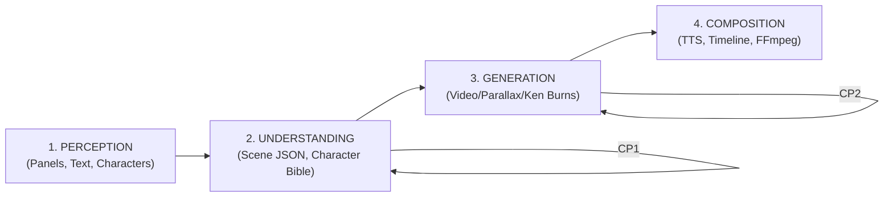

# 🎬 Manhwa → Anime Prototype Proposal — Deep Analysis Report

> **Analyzed document**: [Manhwa_to_Anime_Prototype_Proposal.pdf](file:///c:/hihry/Ani/Manhwa_to_Anime_Prototype_Proposal.pdf)  
> **Analysis date**: 6 October 2026  
> **Version analyzed**: v0.1 (draft for review)

---

## 1. Understanding the Idea

### What You're Building
An **open-source AI pipeline** that takes 2–3 pages of a **manhwa** (Korean vertical-scroll comic) and converts them into a **15–40 second anime-style animated clip** with voices, subtitles, and proper storytelling.

### The Pipeline in Plain English
```
Manhwa Pages → Panel Detection → Text/Character Recognition → Scene Understanding
    → Text Removal → Video Generation → Voice Acting → Final Video Assembly
```

### Key Innovation
The proposal is **hybrid by design** — it doesn't naively throw everything at AI video generation. Instead, it uses a **shot routing system**:
- **Hero panels** (action, close-ups, key story beats) → AI image-to-video generation
- **Subtle panels** (dialogue, atmosphere) → 2.5D parallax effect
- **Static panels** (establishing shots) → Ken Burns pan/zoom

This is the **correct approach**. Current AI video models produce artifacts on stylized art, so minimizing their use to only high-impact moments is smart.

### Why This Matters
There is virtually **no open-source tooling** that does this end-to-end today:
- **ACMP** (the closest project) has 0 stars, 18 commits, no audio, no dialogue
- **anime-pipeline** starts from text (not existing art) and uses paid APIs
- Commercial tools (Frameo, etc.) are closed-source

This is a genuine gap in the open-source ecosystem.

---

## 2. Market & Landscape Research

### Existing Projects (Verified)

| Project | Status | Relevance | Limitation |
|---------|--------|-----------|------------|
| [ACMP](https://github.com/vc-tr/acmp) | Tiny hobby project (0 stars, 18 commits) | End-to-end skeleton, Ken Burns fallback | No dialogue, no audio, untested detector |
| [anime-pipeline](https://github.com/tongli-2026/anime-pipeline) | Small project (1 star) | Checkpointed state, character locking, budget router | Starts from text, not art; relies on paid APIs |
| [Magi/Magiv2/Magiv3](https://github.com/ragavsachdeva/magi) | Active research (best comic perception) | Panel/text/character detection, speaker attribution | Trained on **manga**, not verified on color manhwa |
| StoryDiffusion | Research | Consistent character generation across frames | Image generation, not video; different use case |

### Commercial Landscape
- **Frameo** and similar tools: Closed, not inspectable
- **Manual workflows** (Luma/Kling on individual panels): Per-panel manual effort, closed models
- **Dashtoon**, **ToonCrafter**: Adjacent but different problem spaces

> [!IMPORTANT]
> **Your proposal correctly identifies the market gap.** No existing project combines: (a) starting from existing comic art, (b) open-source only, (c) end-to-end with audio, and (d) intelligent shot routing. This is worth building.

---

## 3. Best Approaches & Identified Issues

### ✅ What the Proposal Gets Right

1. **Hybrid routing strategy** — The hero/subtle/static routing is the single most important design decision and it's correct. AI video on every panel would produce unwatchable results.

2. **Clean-plate approach** — Removing text before video generation is essential. Video models garble text, and this is well-known.

3. **Fallback chains everywhere** — Every expensive operation degrades gracefully to a cheaper alternative. A run never fails.

4. **Human checkpoints** — CP1 (after understanding) and CP2 (after routing) are placed at exactly the right points.

5. **Phase 3 bake-off** — Testing models with evidence instead of leaderboards is the right engineering approach.

6. **Content-hash caching** — Idempotent stages with hash-keyed caching is essential for iterative development.

7. **Compute tiers** — Defining T0/T1/T2/T3 upfront is practical.

### ⚠️ Issues, Mistakes & Gaps Found

#### Issue 1: Magiv3 on Manhwa — THE #1 Risk
> [!CAUTION]
> **Magiv3 was trained on manga (black-and-white, right-to-left, page-based layout).** Manhwa is fundamentally different: full color, vertical scroll, left-to-right reading order, often borderless panels with overlapping art. The proposal acknowledges this but **underestimates the risk**.

**Evidence**: Magiv3's paper (arXiv 2503.23344) describes training data as manga pages. There are no reported evaluations on Korean webtoon/manhwa format. The panel detection, character clustering, and speech-bubble tail linking all assume manga conventions.

**Recommendation**: 
- Run Magiv3 on 5+ manhwa pages **immediately** in Phase 0 (not "one page smoke test")
- Prepare a **dedicated manhwa panel detector** as a real fallback (not just OpenCV gutter slicing)
- Consider fine-tuning Magiv3 on a small manhwa dataset (20-50 annotated pages)
- Look into [kumiko](https://github.com/njean42/kumiko) for panel detection as an additional option

#### Issue 2: Korean TTS is a Weak Spot
> [!WARNING]
> **Neither Chatterbox nor Kokoro supports Korean well.** Chatterbox is primarily English-focused with zero-shot cloning. Kokoro supports 8 languages but Korean support quality is unverified.

**Research findings**:
- **Chatterbox** (Resemble AI): MIT license ✓, excellent zero-shot voice cloning from ~5s of audio, but language support is primarily English. Japanese/Korean quality is uncertain.
- **Kokoro**: Apache 2.0 ✓, 82M params, CPU-capable, 54 pre-built voices, 8 languages. Lightweight but not designed for voice cloning.
- **Qwen3-TTS**: Supports 10 languages including Japanese and Korean. However, **license status is unverified** and availability needs confirmation.

**Recommendation**: 
- Add **Edge-TTS** (Microsoft, free API) as a quick prototype fallback for Korean/Japanese
- Prioritize Qwen3-TTS verification in Phase 0
- Consider **StyleTTS2** for higher quality English narration
- For Korean specifically, investigate **MeloTTS** (MIT, supports Korean)

#### Issue 3: Video Model Character Consistency — Understated
> [!WARNING]
> The proposal rates P5 (character consistency) as "High" risk but the mitigation ("condition on original panel pixels; short clips; identity-similarity QC") is insufficient.

**Reality**: Current image-to-video models fundamentally don't have cross-clip memory. Even conditioning on source pixels, face/hair/outfit details drift significantly within 3-5 second clips. The identity-similarity QC will catch failures but won't fix them.

**Missing approaches**:
- **IP-Adapter** for video models: Inject character identity embeddings during generation
- **Reference-only ControlNet**: Feed character reference images as conditioning
- **ConsistI2V** and similar consistency-focused models
- **Frame interpolation** between panels (FILM, RIFE) as an alternative to full I2V for some shots
- Consider **Wan 2.2 VACE** (Video Anything Creation Engine) which supports more controllable generation

#### Issue 4: No Depth-of-Field or Camera Motion Planning
The proposal mentions "motion_prompt" in the panel JSON (e.g., "slow push-in, hair sways, dust drifts") but there's no systematic camera motion planning system.

**Recommendation**: Add a **camera motion taxonomy** to the shot router:
- Map shot types to default camera behaviors (close-up → subtle zoom, wide → slow pan, action → dynamic track)
- Use depth maps to guide parallax intensity
- Add speed/easing curves per shot type

#### Issue 5: Timeline Pacing is Under-Specified
The proposal says "durations from dialogue length" but pacing is much more than that:
- Dramatic pauses after reveals
- Beat timing for comedy
- Action sequence acceleration
- Scene-to-scene breathing room

**Recommendation**: Add a **pacing model** — even rule-based — that considers:
- Panel type (action vs. dialogue vs. reaction)
- Dialogue length + reading speed
- Scene transitions (same scene vs. scene change)
- Music/ambient timing (when implemented)

#### Issue 6: LangGraph May Be Overengineered for This
> [!NOTE]
> LangGraph is designed for **LLM agent orchestration** (tool calling, decision-making, conversation flow). This pipeline is a **deterministic data processing pipeline** with some ML inference steps.

**Research findings**:
- LangGraph excels at: multi-agent conversations, tool-calling loops, human-in-the-loop for LLM decisions
- This pipeline needs: GPU resource management, model loading/unloading, crash recovery, progress tracking

**Better alternatives considered**:
| Tool | Fit | Why |
|------|-----|-----|
| **Prefect** | ⭐⭐⭐⭐ | Built for ML pipelines, native retry/caching, nice UI, easy to learn |
| **Dagster** | ⭐⭐⭐⭐ | Asset-based (perfect for artifact-passing), type checking, great for data pipelines |
| **Custom state machine** | ⭐⭐⭐⭐⭐ | Simplest, most control, no dependency overhead |
| **LangGraph** | ⭐⭐⭐ | Workable but brings unnecessary complexity for non-LLM orchestration |
| **Temporal.io** | ⭐⭐⭐ | Overkill for single-machine prototype |

**Recommendation**: For a v0.1 prototype by one developer, a **custom state machine with Pydantic models** is the best choice. It's simpler, lighter, and you already need Pydantic for the data contracts. LangGraph adds cognitive overhead without proportional benefit. If you want a production framework later, Dagster's asset-based model maps perfectly to your artifact-passing architecture.

#### Issue 7: ComfyUI as Video Backend — Good Choice, But Fragile
ComfyUI is well-supported for Wan 2.2 and HunyuanVideo, with active community workflows. However:
- **Workflow JSON format** can break between ComfyUI versions
- **API mode** reliability varies
- No built-in queue management for batch generation

**Recommendation**: Use ComfyUI for prototyping but plan a **direct model loading path** using `diffusers` library as a more robust production alternative.

---

## 4. Suggested Changes & Improvements

### Priority 1: Critical (Do Before Starting)

| # | Change | Why |
|---|--------|-----|
| 1 | **Expand Magiv3 smoke test** to 5+ diverse manhwa pages including borderless panels, action sequences, and vertical-scroll-specific layouts | The entire pipeline depends on perception. If Magiv3 fails on manhwa, you need to know immediately. |
| 2 | **Verify Korean TTS** capabilities. Test Qwen3-TTS, MeloTTS, and Edge-TTS on Korean dialogue samples | Korean is listed as a primary source language but no tested Korean TTS exists in the stack. |
| 3 | **Add a manhwa-specific panel detector** as a real fallback, not just OpenCV gutter slicing | Vertical-scroll manhwa with overlapping art will defeat gutter slicing. |

### Priority 2: High (Improve the Design)

| # | Change | Why |
|---|--------|-----|
| 4 | **Replace LangGraph** with a custom Pydantic state machine or Dagster | Simpler, more appropriate for the problem, less dependency overhead. |
| 5 | **Add IP-Adapter or reference conditioning** to the video generation step | Critical for character consistency, the #1 quality concern. |
| 6 | **Design a camera motion taxonomy** mapped to shot types | Makes motion prompts systematic rather than ad-hoc. |
| 7 | **Add pacing rules** beyond "duration from dialogue length" | Pacing is what makes animation feel alive vs. a slideshow. |
| 8 | **Consider Wan 2.2 VACE** (if available) for more controllable generation | VACE supports depth/pose/edge conditioning, improving consistency. |

### Priority 3: Medium (Nice to Have)

| # | Change | Why |
|---|--------|-----|
| 9 | **Add a direct `diffusers` inference path** alongside ComfyUI | More robust for batch processing and automation. |
| 10 | **Investigate frame interpolation** (FILM/RIFE) as a 4th animation lane | Between parallax and full I2V — useful for "minimal motion" panels. |
| 11 | **Add subtitle styling** system (anime-style positioned text) | Plain subtitles look amateur; styled text can match the manhwa's typography. |
| 12 | **Consider SAM2 for layer separation** in the parallax lane | Better foreground/background separation than depth maps alone. |
| 13 | **Add a simple SFX system** using MMAudio even in v0.1 | Impact sounds and ambient noise significantly improve the feel. |

### Priority 4: Stretch Goals (Post v0.1)

| # | Change | Why |
|---|--------|-----|
| 14 | Per-character **LoRA training** for video generation | The most impactful quality improvement for character consistency. |
| 15 | **Music scoring** with ACE-Step or similar | Transforms the clip from "demo" to "watchable content." |
| 16 | **Lip-sync** with open-source tools (Wav2Lip, SadTalker) | Natural next step after basic TTS works. |

---

## 5. Architecture Assessment

### Current Architecture: 4-Layer Pipeline



### Verdict: The layered architecture is **fundamentally sound** ✅

The 4-layer design with versioned artifacts between layers is a well-established pattern for ML pipelines. The key strengths:

1. **Decoupled stages** — Each can be developed, tested, and replaced independently
2. **Artifact passing** — Intermediate results are inspectable and cacheable
3. **Human checkpoints** — Placed at the right points (post-understanding, post-routing)
4. **Fallback chains** — Every expensive operation has a cheaper alternative

### Architecture Improvements

#### A. Model Serving Strategy (Needs Rethinking)

The proposal says "one heavy model resident at a time" — this is correct but the **model swapping strategy** needs more detail:

```
Current (implicit):
  Load Qwen3-VL → run understanding → unload
  Load Wan 2.2 → run video gen → unload
  Load Chatterbox → run TTS → unload

Better (batch by model):
  Load Qwen3-VL → run ALL understanding → unload
  Load LaMa → run ALL clean plates → unload
  Load Wan 2.2 → run ALL hero panels → unload
  Load Chatterbox → run ALL TTS → unload
```

**Recommendation**: The pipeline should be **model-aware** and batch operations by model to minimize load/unload overhead. The state machine should track which model is currently resident and queue work accordingly.

#### B. Artifact Store Design

The proposal mentions `runs/<run_id>/` folder structure. This should be expanded:

```
runs/<run_id>/
  config.yaml           # Full config snapshot (reproducibility)
  state.json            # LangGraph/state machine state
  ledger.json           # Cost and time tracking
  
  panels/               # Raw extracted panels
  panels_annotated/     # Panels with bounding boxes (debug)
  clean_plates/         # Text-removed panels
  
  understanding/
    panel_json/         # Per-panel JSON contracts
    character_bible.json
    
  generation/
    clips/              # Raw generated clips (all takes)
    clips_accepted/     # QC-passed clips
    qc_reports/         # Per-clip QC metrics
    
  audio/
    tts/                # Per-character audio files
    
  composition/
    timeline.json       # Full timeline definition
    out.mp4             # Final output
```

#### C. Error Recovery Needs More Thought

The proposal says "checkpointed state machine; idempotent nodes" but doesn't address:
- What happens if a model produces garbage but doesn't crash? (Handled by QC ✓)
- What if the VLM produces invalid JSON? (Needs retry with different temperature/prompt)
- What if all video generation takes fail QC? (Falls to Ken Burns ✓)
- What about OOM errors during video generation? (Needs: reduce resolution, switch to smaller model variant)

**Add an OOM recovery strategy**: If Wan 2.2 A14B OOMs, automatically retry with TI2V-5B at lower resolution.

---

## 6. Model Optimization Assessment

### Are the chosen models optimal? Mixed verdict.

#### ✅ Good Choices

| Model | Role | Verdict |
|-------|------|---------|
| **Qwen3-VL-8B** | Scene understanding | ✅ Excellent choice. Apache 2.0, native structured output, strong multilingual OCR. The 4B/2B fallbacks for small GPUs are well-considered. |
| **LaMa** | Text inpainting | ✅ Still the best for this task. Light, fast, Apache 2.0. |
| **Wan 2.2 TI2V-5B** | Video generation (dev) | ✅ Good primary choice. Apache 2.0, well-supported in ComfyUI, reasonable VRAM (~8-12 GB FP8). |
| **Real-ESRGAN anime** | Upscaling | ✅ Purpose-built for anime upscaling. |
| **RIFE** | Frame interpolation | ✅ Fast and effective. |

#### ⚠️ Needs Attention

| Model | Role | Issue | Recommendation |
|-------|------|-------|----------------|
| **Wan 2.2 A14B** | Video (quality) | VRAM claims conflict (16-24 GB with FP8+offload vs. ≥80 GB official). **Test this in Phase 0**, not Phase 3. | Validate VRAM on your actual hardware immediately. |
| **HunyuanVideo 1.5** | Video candidate | Tencent Community License has regional exclusions. **Read the license before any work.** | Verify it's usable in your jurisdiction. If not, drop it from the bake-off. |
| **LTX-2.3** | Video candidate | VRAM claims wildly inconsistent ("from 12 GB" vs. "24-32 GB at 720p FP8"). | Needs empirical testing. Also, the "native audio" feature is interesting — could eliminate the need for separate SFX generation. |
| **Magiv3** | Perception | **Trained on manga, not manhwa.** This is the single biggest model risk. | Test on manhwa immediately. Have a real backup plan. |
| **Chatterbox** | TTS | Primarily English. Korean/Japanese quality unverified. | Test Korean samples in Phase 0. |

#### ❌ Missing Models to Consider

| Model | Role | Why Add |
|-------|------|---------|
| **Wan 2.2 VACE** | Controllable video | Supports depth/pose/edge conditioning — could dramatically improve character consistency and motion control |
| **MeloTTS** | Korean TTS | MIT license, supports Korean, good quality |
| **StyleTTS2** | English TTS | Higher quality than Kokoro for English narration |
| **SAM2** | Layer separation | Better foreground/background separation for parallax |
| **FILM** | Frame interpolation | Google's interpolation model, higher quality than RIFE for some cases |
| **IP-Adapter** | Identity preservation | Can be used with video generation to maintain character identity |

### VRAM Budget Reality Check

For the most likely scenario (**T1: 12-16 GB GPU**):

| Step | Model | VRAM (estimated) | Can Coexist? |
|------|-------|-------------------|-------------|
| Understanding | Qwen3-VL-8B (4-bit) | ~5-6 GB | ✅ |
| Clean plates | LaMa | ~1-2 GB | ✅ with VLM |
| Video gen | Wan 2.2 TI2V-5B (FP8) | ~8-12 GB | ❌ Solo |
| TTS | Chatterbox | ~4-6 GB | ✅ after video |
| Perception | Magiv3 | ~3-4 GB | ✅ |

**Key insight**: The bottleneck is video generation. All other models can potentially run concurrently on 16 GB, but video generation needs the GPU alone. The "batch by model" strategy is essential.

---

## 7. Summary of Recommendations

### Top 5 Things to Do Differently

1. **🔴 Test Magiv3 on manhwa immediately** (5+ pages, not 1) — if it fails, your entire perception layer needs redesign
2. **🔴 Verify Korean TTS before committing** — test Qwen3-TTS, MeloTTS, Edge-TTS on actual Korean dialogue
3. **🟡 Simplify orchestration** — replace LangGraph with a custom Pydantic state machine for v0.1
4. **🟡 Add IP-Adapter/reference conditioning** for character consistency in video generation
5. **🟡 Design a camera motion taxonomy** instead of ad-hoc motion prompts

### Top 5 Things the Proposal Does Well

1. **✅ Hybrid routing strategy** — The single best design decision
2. **✅ Clean-plate approach** — Essential and correctly placed
3. **✅ Phase 3 bake-off** — Evidence-based model selection
4. **✅ Fallback chains** — Every path has a degraded-but-working alternative
5. **✅ Artifact-passing architecture** — Clean, cacheable, inspectable

### Risk-Adjusted Priority for the 16 Problems

Re-ranking the proposal's problem register by actual impact:

| Rank | ID | Problem | Proposal's Risk | My Assessment | Why |
|------|----|---------|-----------------|-|-|
| 1 | P1 | Panel segmentation on manhwa | Medium | **🔴 Critical** | Entire pipeline depends on this; manhwa ≠ manga |
| 2 | P5 | Character consistency | High | **🔴 Critical** | No current mitigation beyond QC rejection |
| 3 | P7 | Text garbling | High | **🟡 High** | Clean-plate mitigation is solid |
| 4 | P6 | Style drift | High | **🟡 High** | Short clips + fallback helps |
| 5 | P12 | Compute/VRAM | High | **🟡 High** | Tiered approach helps; still the main practical blocker |
| 6 | P4 | Speaker attribution | High | **🟡 Medium** | Magiv3 handles this well — IF it works on manhwa |
| 7 | P3 | Korean OCR | Medium | **🟡 Medium** | Qwen3-VL is strong here |
| 8 | P11 | Audio design | Medium | **🟡 Medium** | Korean TTS gap makes this higher risk than stated |

---

> [!TIP]
> **Recommended next step**: Before any coding, spend **1 day** running Magiv3 + Qwen3-VL on 5 diverse manhwa pages. If perception works, you have a viable project. If not, you need to pivot the perception layer first. This one experiment de-risks the entire project.

